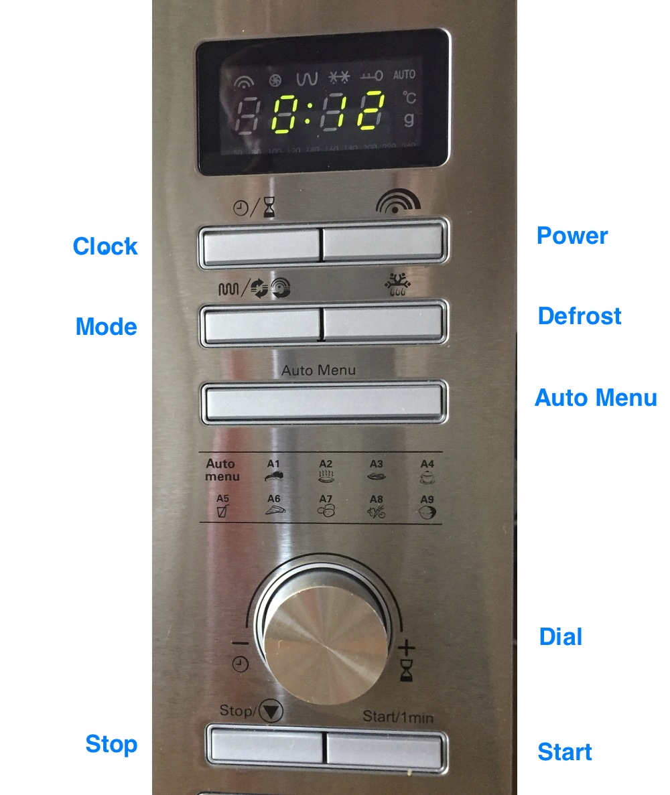
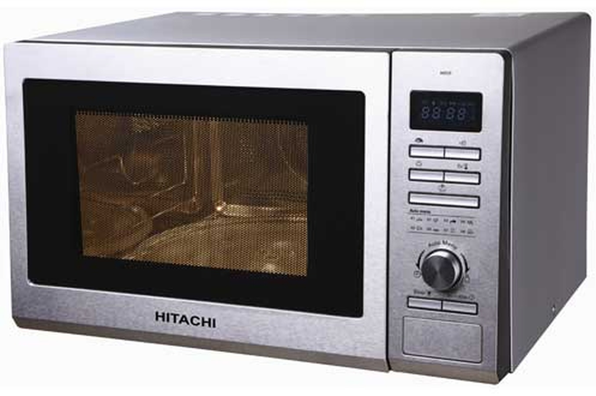
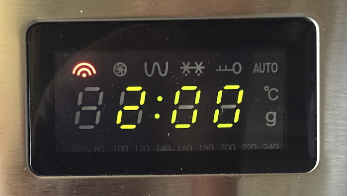

# A C++ state machine that mimics the complex behavior of a microwave

This project is the result of a web lab from a class at Télécom Paris as part of my Master's Degree in Computer Science.

## About the course: **IGR203 - Human-Computer Interaction**

- Software Development - C++ _**This lab fits here**_
- User-Centered Design
- Web Interfaces - Js & Node.js 
- Arduino

## About this lab

### Tech stack

- C++
- [Qt](https://www.qt.io)

### Goal of the project

The goal was to create a state machine that would replicate the behavior of the following microwave. The idea was not to create a user-friendly application, if anything, it was to reproduce the complex functionalities of this non-user-friendly microwave.

<p>
  
  <p align="left">
      
      
  </p>
</p>

You can find a detailed explanation of how this microwave should work at [the bottom of the page](#detailed-behavior-of-the-microwave). But the statechart I have made in the next section should be enough to understand the idea.

#### Step 1: design a statechart

Before starting to code, we were supposed to create a statechart to better grasp how the whole thing should be developed. Here is the statechart I have created for this exercise (which I did using figjam):


## Installation

### If you have a Mac

You can just download the version in the [releases](https://github.com/0ranga/microwave/releases) tab. Note that you will have to right click on the app and click `open` then confirm after Apple tells you that it is not from a verified developer.

### If you don't have a Mac

I am currently working on releasing a Windows version, in the meantime, you can follow these steps:

1. You should have [Qt](https://www.qt.io) installed as well as the `Qt State Machine` module that you can install with the Maintenance Tool that comes with Qt.
2. Clone this repository
```sh
git clone https://github.com/0ranga/microwave.git
```
3. Navigate to the project directory.
```sh
cd microwave
```
4. Double click on the file `Microwave.pro` it should open the project with Qt Creator.
5. Run the application within Qt Creator.

# Preview of the app


# *Detailed behavior of the microwave:*

The buttons on the microwave panel are:

- Clock: Sets the hours (by clicking once), then the minutes (by clicking again), a third click validates.
- Power: Adjusts the power, from 0 to 100% (first click), then the cooking duration (second click). The oven can then be started by clicking on Start.
- Mode: Sets the mode: microwave, grill, microwave+grill (first click), then the cooking duration (second click). The oven can then be started by clicking on Start.
- Defrost: Adjusts the cooking duration according to the weight of the food to be defrosted. The oven can then be started by clicking on Start.
- Auto Menu: Not used in this Lab
- Dial: Rotary knob that allows choosing a value. This value depends on the selected state (e.g. when setting the hour, it changes the hour, when setting the minutes, it changes the minutes, etc.)
- Start: Starts cooking.
- Stop: Stops cooking or cancels any operation.

Note that, when a setting sequence is started, no other button is active, except the Stop button, which cancels any operation. For instance:
If Clock: is clicked, only this button (and Stop) is active until the clock is set.
If Power: is clicked, only this button (and Stop) is active until the power and the duration are set. Once done, clicking on Start starts cooking with these settings.

The Start button can be clicked:
At the end of a Power, Mode or Defrost sequence
When the oven is idle, in which case the oven starts cooking with default values (60 seconds, full power).
When the oven is cooking, in which case the cooking time is increased by 60 seconds.
The display panel shows different information depending on currently active state. For instance:

When setting the hour it shows the hour, when setting the power it shows the power, etc.
When the oven is idle it shows the current time, as a normal clock
When the oven is cooking it shows the remaining cooking duration

Finally:
The clock should display the current time, as a normal clock (only when the microwane oven is idle)
The microwave oven should stop cooking when the cooking duration has expired.
